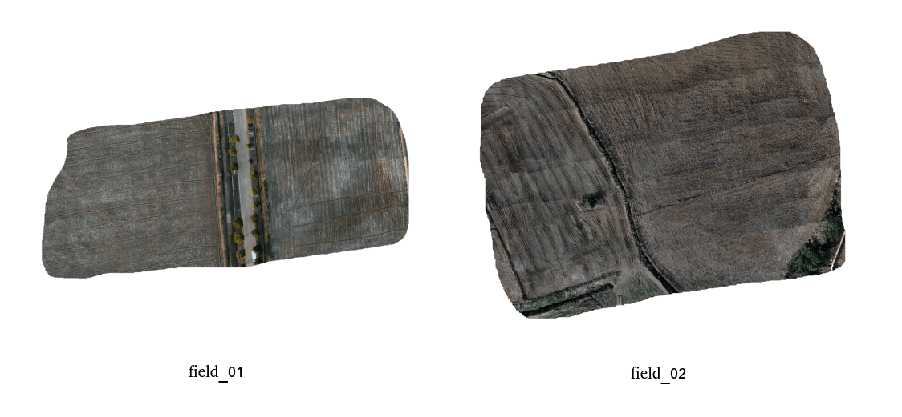

# ortho_mapper

**The repository contains the source code for ortho_mapper module of our system. This partial release aims to provide insight into the underlying implementation of our approach and may be useful for researchers working in related areas.**

**This is a simple and easy-to-use package for checking the quality of SfM through generating orthoimage quickly.**




## Prerequisited
- Eigen3
- OpenCV3
- PCL
- TIFF
- JSONCPP

## Example

To test this package, you can use images which has **EXIF for GPS**, use **'dev_3.10'** in [colmap](https://github.com/zhan994/colmap_detailed.git)

```bash
./work/shell/sfm_cam_gps.sh
```

Change intrinsics about camera in **'config/cfg.json'**.

```bash
mkdir build && cd build
cmake ..
make -j
./build/ortho_mapper config/cfg.json
```

