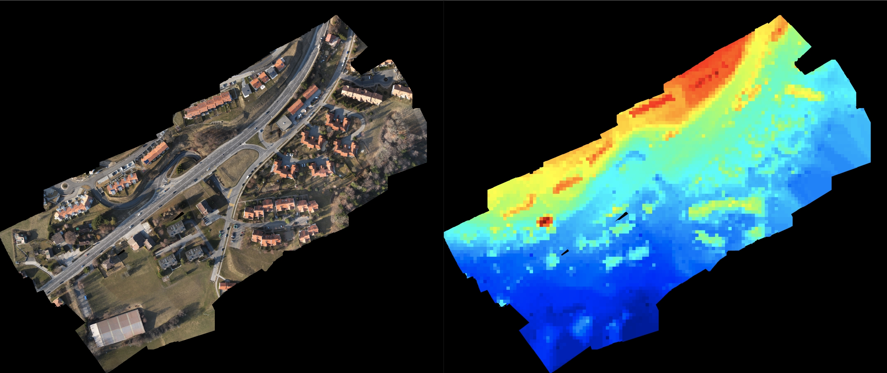

# ortho_mapper

***A Multi-Sensor Fusion Approach for Rapid Orthoimage Generation in Large-Scale UAV Mapping***


**The repository contains the source code for ortho_mapper module of our system. This partial release aims to provide insight into the underlying implementation of our approach and may be useful for researchers working in related areas.**

**This is a simple and easy-to-use package for checking the quality of SfM through generating orthoimage quickly.**


## Prerequisited
- Eigen3
- OpenCV3
- PCL
- TIFF
- JSONCPP

## Example

To test this package, you can use images which has **EXIF for GPS**, use **'dev_3.10'** in [colmap](https://github.com/zhan994/colmap_detailed.git)

```bash
./work/shell/sfm_cam_gps.sh
```

Change intrinsics about camera in **'config/cfg.json'**.

```bash
mkdir build && cd build
cmake ..
make -j
./build/ortho_mapper config/cfg.json
```

The program writes `result.tif` and an aligned single-band, 32-bit floating point `dsm.tif`. 
DSM pixels use the same terrain samples and valid footprint as the orthoimage. 
Invalid DSM pixels are stored as `NaN`; valid values are the absolute altitudes returned by the repository's ENU-to-geodetic conversion.
It also writes an aligned `dsm_vis.png`, using blue for low elevations, red for high elevations, and black for invalid pixels.




## Citation

```
@inproceedings{he2025multi,
  title={A multi-sensor fusion approach for rapid orthoimage generation in large-scale uav mapping},
  author={He, Jialei and Zhan, Zhihao and Tu, Zhituo and Zhu, Xiang and Yuan, Jie},
  booktitle={2025 IEEE/RSJ International Conference on Intelligent Robots and Systems (IROS)},
  pages={6808--6815},
  year={2025},
  organization={IEEE}
}
```
